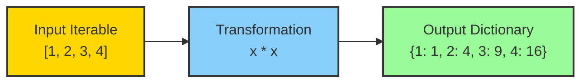
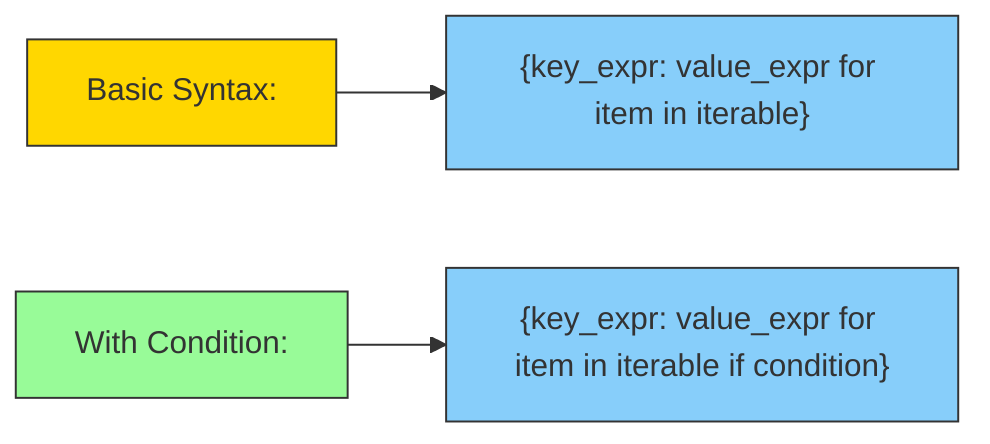

## 🌟 Introduction to Dictionary Comprehensions

Imagine creating dictionaries with the elegance of a poet and the efficiency of a computer scientist. Dictionary comprehensions are Python's concise way of transforming and creating dictionaries in a single, readable line of code.

### 📌 🖼️ Visual Representation of Dictionary Comprehension



### 📌 🧩 Key Characteristics of Dictionary Comprehensions

Dictionary comprehensions are powerful Python constructs that:

- Create dictionaries in a single line of code
- Transform and filter data simultaneously
- Provide a more readable alternative to multiple-line dictionary creation
- Follow a similar syntax to list comprehensions

### 📌 🔍 Syntax Breakdown



## 💻 Python Implementation and Examples

### 🎯 Basic Dictionary Comprehension

```python
# Square numbers dictionary
squares = {x: x**2 for x in range(1, 6)}
print(squares)  # {1: 1, 2: 4, 3: 9, 4: 16, 5: 25}

# Convert list to dictionary with index
fruits = ['apple', 'banana', 'cherry']
fruit_indices = {fruit: index for index, fruit in enumerate(fruits)}
print(fruit_indices)  # {'apple': 0, 'banana': 1, 'cherry': 2}
```

### 🎮 🧠 Advanced Examples

```python
# Filter even numbers and create their squares
even_squares = {x: x**2 for x in range(1, 11) if x % 2 == 0}
print(even_squares)  # {2: 4, 4: 16, 6: 36, 8: 64, 10: 100}

# Create a dictionary from two lists
names = ['Alice', 'Bob', 'Charlie']
ages = [25, 30, 35]
name_age_dict = {name: age for name, age in zip(names, ages)}
print(name_age_dict)  # {'Alice': 25, 'Bob': 30, 'Charlie': 35}
```

### 🚀 Complex Transformations

```python
# Nested dictionary comprehension
nested_dict = {
    x: {y: x*y for y in range(1, 4)}
    for x in range(1, 4)
}
print(nested_dict)
# {
#   1: {1: 1, 2: 2, 3: 3},
#   2: {1: 2, 2: 4, 3: 6},
#   3: {1: 3, 2: 6, 3: 9}
# }

# Dictionary from a dictionary
original = {'a': 1, 'b': 2, 'c': 3}
doubled = {k: v*2 for k, v in original.items()}
print(doubled)  # {'a': 2, 'b': 4, 'c': 6}
```

## 🎯 Performance and Time Complexities

## 📌 🌈 Comparison with Traditional Methods

### 📌 Dictionary Comprehension vs. Traditional Loops

```python
# Traditional Method
names = ['Alice', 'Bob', 'Charlie']
traditional_dict = {}
for name in names:
    traditional_dict[name] = len(name)

# Dictionary Comprehension
comprehension_dict = {name: len(name) for name in names}

# Both produce: {'Alice': 5, 'Bob': 3, 'Charlie': 7}
```

## 🎨 Real-world Applications

1. Data Transformation

2. Converting data between formats

3. Cleaning and preprocessing data

4. Configuration Management

5. Dynamic configuration dictionaries

6. Mapping keys and values

7. Caching Mechanisms

8. Creating lookup tables

9. Memoization techniques

10. Text Processing

11. Character frequency counts

12. Word mapping and analysis

## 📝 Best Practices

1. Keep comprehensions readable

2. Avoid complex nested comprehensions

3. Use conditions sparingly

4. Prioritize readability over brevity

5. Consider traditional loops for complex logic

## 📊 🚨 Common Pitfalls

```python
# Potential Gotchas
# Duplicate keys will overwrite previous values
duplicate_keys = {x: x**2 for x in [1, 2, 2, 3]}
print(duplicate_keys)  # {1: 1, 2: 4, 3: 9}

# Memory considerations for large datasets
# Use generator expressions for memory efficiency
large_dict = {x: x**2 for x in range(1_000_000)}  # Memory intensive!
```

## 🎮 🎮 Interactive Example: Word Frequency Analysis

```python
def word_frequency_analyzer(text):
    # Analyze word frequencies with dictionary comprehension
    words = text.lower().split()
    freq_dict = {word: words.count(word) for word in set(words)}
    return dict(sorted(freq_dict.items(), key=lambda x: x[1], reverse=True))

text = "the quick brown fox jumps over the lazy dog"
print(word_frequency_analyzer(text))
# {'the': 2, 'quick': 1, 'brown': 1, 'fox': 1, 'jumps': 1, 'over': 1, 'lazy': 1, 'dog': 1}
```

## 🎯 Practice Exercises

1. Create a dictionary of prime numbers and their squares

2. Implement a function to invert a dictionary

3. Generate a dictionary of numbers and their cube roots

4. Create a dictionary comprehension with multiple conditions

5. Build a dictionary that converts temperature from Celsius to Fahrenheit

## 🚀 🧩 Advanced Challenge

Develop a dictionary comprehension that:

- Accepts a list of words
- Creates a dictionary of words and their lengths
- Filters out words shorter than 4 characters
- Sorts the result by word length

```python
def advanced_word_dict(words):
    return {word: len(word) for word in words if len(word) >= 4}

# Test the function
test_words = ['python', 'is', 'awesome', 'programming', 'fun']
print(advanced_word_dict(test_words))
# Expected: {'python': 6, 'awesome': 7, 'programming': 11}
```

Remember: Dictionary comprehensions are a powerful tool in your Python arsenal. Practice, experiment, and let your code shine with conciseness and clarity!
