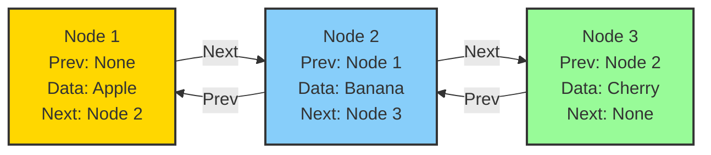
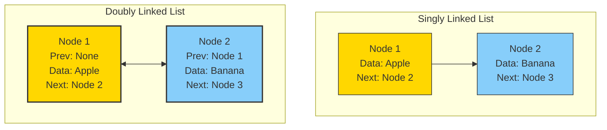

## 🌟 Introduction to Doubly Linked Lists

Imagine a two-way street where you can travel forward and backward with equal ease. In the realm of data structures, a doubly linked list is exactly that—a dynamic, flexible chain of nodes that can be traversed in both directions.

### 🏗️ 🖼️ Visual Structure of a Doubly Linked List



### 📌 🧩 Key Characteristics of Doubly Linked Lists

Doubly linked lists extend the capabilities of singly linked lists with unique features:

- Bidirectional traversal (forward and backward)
- Each node contains data, a next reference, and a previous reference
- More flexible manipulation of elements
- Slightly more memory overhead compared to singly linked lists

### 📌 🔍 Doubly vs Singly Linked Lists



## 💻 Python Implementation of Doubly Linked List

```python
class Node:
    def __init__(self, data):
        self.prev = None    # Reference to previous node
        self.data = data    # The data value
        self.next = None    # Reference to next node

class DoublyLinkedList:
    def __init__(self):
        self.head = None    # First node in the list
        self.tail = None    # Last node in the list

    def append(self, data):
        new_node = Node(data)

        # If list is empty
        if not self.head:
            self.head = new_node
            self.tail = new_node
            return

        # Connect new node to the end
        new_node.prev = self.tail
        self.tail.next = new_node
        self.tail = new_node

    def prepend(self, data):
        new_node = Node(data)

        # If list is empty
        if not self.head:
            self.head = new_node
            self.tail = new_node
            return

        # Connect new node to the beginning
        new_node.next = self.head
        self.head.prev = new_node
        self.head = new_node

    def display_forward(self):
        elements = []
        current = self.head
        while current:
            elements.append(current.data)
            current = current.next
        return ' <-> '.join(map(str, elements))

    def display_backward(self):
        elements = []
        current = self.tail
        while current:
            elements.append(current.data)
            current = current.prev
        return ' <-> '.join(map(str, elements))

# Example usage
my_list = DoublyLinkedList()
my_list.append("Apple")
my_list.append("Banana")
my_list.prepend("Cherry")
print("Forward:", my_list.display_forward())
print("Backward:", my_list.display_backward())
```

## 🎯 Common Operations and Time Complexities

## 🚀 Advanced Features

### 📌 Inserting a Node at a Specific Position

```python
def insert_after(self, target_data, new_data):
    current = self.head
    while current:
        if current.data == target_data:
            new_node = Node(new_data)
            new_node.prev = current
            new_node.next = current.next

            if current.next:
                current.next.prev = new_node
            current.next = new_node

            # Update tail if inserting at the last node
            if current == self.tail:
                self.tail = new_node
            return True
        current = current.next
    return False
```

### 📌 Reversing a Doubly Linked List

```python
def reverse(self):
    current = self.head
    while current:
        # Swap next and prev pointers
        current.next, current.prev = current.prev, current.next

        # Move to next node
        if not current.prev:
            self.tail = self.head
            self.head = current
            break

        current = current.prev
```

## 🎨 Real-world Applications

1. Browser History

2. Forward and backward navigation

3. Efficiently move between pages

4. Music Player

5. Next and previous track functionality

6. Easy playlist traversal

7. Undo/Redo Mechanisms

8. Bidirectional state tracking

9. Complex application histories

10. Memory Management

11. Dynamic memory allocation

12. Efficient block management

## 📝 Best Practices

1. Always update both next and prev pointers

2. Handle edge cases (empty list, single node)

3. Maintain head and tail references

4. Be careful with pointer manipulations

5. Consider using sentinel nodes for complex operations

## 🎮 🎮 Interactive Example: Music Playlist

```python
class MusicPlaylist:
    def __init__(self):
        self.current_song = None

    def play_next(self):
        if self.current_song and self.current_song.next:
            self.current_song = self.current_song.next
            return self.current_song.data
        return None

    def play_previous(self):
        if self.current_song and self.current_song.prev:
            self.current_song = self.current_song.prev
            return self.current_song.data
        return None

# Create a playlist
playlist = DoublyLinkedList()
playlist.append("Bohemian Rhapsody")
playlist.append("Stairway to Heaven")
playlist.append("Hotel California")

# Simulate playing
current = playlist.head
print("Now playing:", current.data)
```

## 🎯 Practice Exercises

1. Implement a method to delete a node by value

2. Create a circular doubly linked list

3. Implement a queue using a doubly linked list

4. Write a function to find the middle element

5. Develop a method to rotate the list

Remember: Mastering doubly linked lists requires patience, practice, and a clear understanding of pointer manipulations!
