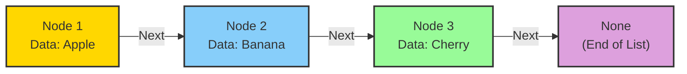
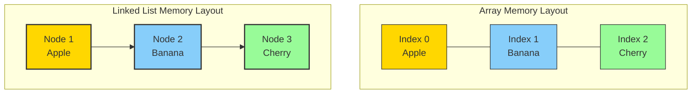
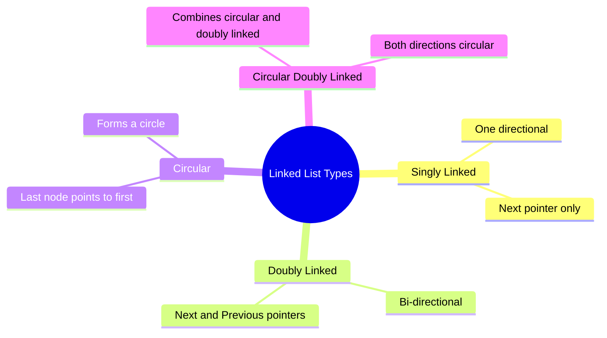

## 🌟 Introduction to Linked Lists

Imagine a treasure hunt where each clue is connected to the next, forming a chain of discovery. In the world of data structures, a linked list follows this exact metaphor. Unlike arrays with their neat, side-by-side memory slots, linked lists are more like a dynamic chain of interconnected nodes.

### 🖼️ Visual Structure of a Linked List



### 🧩 Key Characteristics of Linked Lists

Linked lists are unique data structures with several defining features:

- Dynamic size that can grow or shrink
- Non-contiguous memory allocation
- Each element (node) contains data and a reference to the next node

### 🔍 Linked Lists vs Arrays: A Visual Comparison



## 🧠 Types of Linked Lists



## 💻 Python Implementation

Here's a basic implementation of a singly linked list in Python:

```python
class Node:
    def __init__(self, data):
        self.data = data    # The data value
        self.next = None    # Reference to next node

class LinkedList:
    def __init__(self):
        self.head = None    # First node in the list

    def append(self, data):
        new_node = Node(data)

        # If list is empty, make new node the head
        if not self.head:
            self.head = new_node
            return

        # Traverse to the end and add new node
        current = self.head
        while current.next:
            current = current.next
        current.next = new_node

    def display(self):
        elements = []
        current = self.head
        while current:
            elements.append(current.data)
            current = current.next
        return ' -> '.join(map(str, elements))

# Example usage
my_list = LinkedList()
my_list.append("Apple")
my_list.append("Banana")
my_list.append("Cherry")
print(my_list.display())  # Output: Apple -> Banana -> Cherry
```

## 🎯 Common Operations

Here are the time complexities for common linked list operations:

| Operation      | Time Complexity | Description                |
| -------------- | --------------- | -------------------------- |
| Access         | O(n)            | Need to traverse from head |
| Insert at head | O(1)            | Just update head pointer   |
| Insert at tail | O(n)            | Need to traverse to end    |
| Delete at head | O(1)            | Just update head pointer   |
| Delete at tail | O(n)            | Need to traverse to end    |
| Search         | O(n)            | Need to traverse list      |

## 🚀 Advanced Features

### Reversing a Linked List

```python
def reverse(self):
    prev = None
    current = self.head

    while current:
        next_temp = current.next  # Store next
        current.next = prev       # Reverse pointer
        prev = current           # Move prev forward
        current = next_temp      # Move current forward

    self.head = prev            # Update head
```

### Detecting Cycles

```python
def has_cycle(self):
    if not self.head:
        return False

    slow = self.head
    fast = self.head

    while fast and fast.next:
        slow = slow.next         # Move one step
        fast = fast.next.next    # Move two steps
        if slow == fast:         # If they meet
            return True

    return False
```

## 🎨 Real-world Applications

1. **Undo/Redo Operations**

   - Each node stores a state
   - Moving back/forward in history

2. **Music Playlist**

   - Songs as nodes
   - Next/Previous functionality

3. **Memory Management**

   - Managing free memory blocks
   - Dynamic memory allocation

4. **Hash Tables**
   - Collision resolution
   - Chaining implementation

## 📝 Best Practices

1. Always maintain a reference to the head
2. Check for null/None when traversing
3. Handle edge cases (empty list, single node)
4. Use helper functions for common operations
5. Consider using sentinel nodes for edge cases

## 🎮 Interactive Example

Try this code in your Python environment:

```python
class Node:
    def __init__(self, data):
        self.data = data
        self.next = None

def create_circular_list():
    # Create nodes
    a = Node('A')
    b = Node('B')
    c = Node('C')

    # Connect nodes
    a.next = b
    b.next = c
    c.next = a  # Create cycle

    return a

# Create and test
head = create_circular_list()
print("Created a circular linked list!")
print(f"First node: {head.data}")
print(f"Second node: {head.next.data}")
print(f"Third node: {head.next.next.data}")
print(f"Back to first: {head.next.next.next.data}")
```

## 🎯 Practice Exercises

1. Implement a doubly linked list
2. Add a method to find the middle node
3. Detect and remove cycles
4. Merge two sorted linked lists
5. Implement a circular buffer using linked list

Remember: The key to mastering linked lists is practice and visualization. Start with simple operations and gradually move to more complex algorithms!
