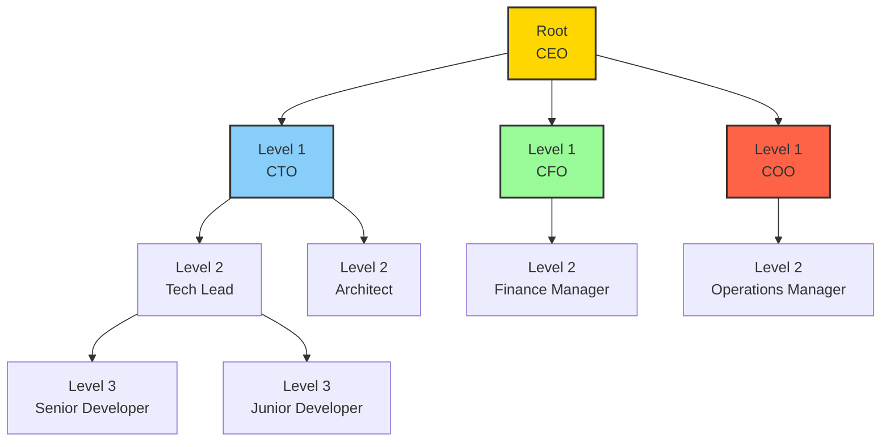
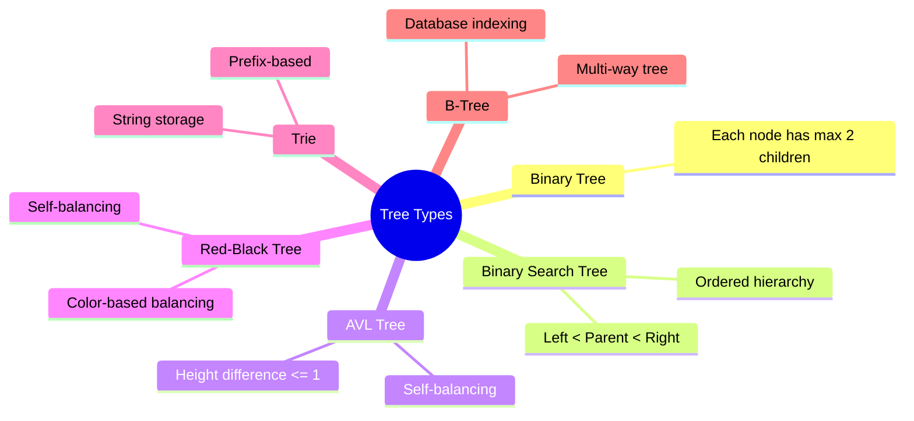

## 🌟 Introduction to Tree Data Structures

Imagine a family genealogy chart, a corporate organizational hierarchy, or the file system on your computer. These are all perfect representations of tree data structures—a fundamental concept in computer science that elegantly models hierarchical relationships.

### 📌 🖼️ Visual Anatomy of a Tree



### 📌 🧩 Fundamental Tree Terminology

Let's break down the essential vocabulary of tree data structures:

1. Node: The basic unit of a tree, containing data and references to other nodes

2. Root: The topmost node of the tree

3. Parent: A node with one or more child nodes

4. Child: A node directly connected to another node when moving away from the root

5. Leaf: A node with no children

6. Depth: The number of edges from the root to a specific node

7. Height: The number of edges on the longest path from a node to a leaf

### 📌 🌈 Types of Trees



## 💻 Python Implementation of a Basic Tree

```python
class TreeNode:
    def __init__(self, data):
        self.data = data
        self.children = []
        self.parent = None

    def add_child(self, child):
        child.parent = self
        self.children.append(child)

    def get_level(self):
        level = 0
        parent = self.parent
        while parent:
            level += 1
            parent = parent.parent
        return level

    def print_tree(self):
        spaces = ' ' * self.get_level() * 3
        prefix = spaces + '|--' if self.parent else ''
        print(f"{prefix}{self.data}")
        for child in self.children:
            child.print_tree()

# Example Usage
def build_organization_tree():
    # Root node
    root = TreeNode("CEO")

    # First-level managers
    cto = TreeNode("CTO")
    cfo = TreeNode("CFO")
    coo = TreeNode("COO")

    # Add first-level managers to root
    root.add_child(cto)
    root.add_child(cfo)
    root.add_child(coo)

    # Second-level employees
    tech_lead = TreeNode("Tech Lead")
    architect = TreeNode("Architect")
    cto.add_child(tech_lead)
    cto.add_child(architect)

    # Third-level employees
    senior_dev = TreeNode("Senior Developer")
    junior_dev = TreeNode("Junior Developer")
    tech_lead.add_child(senior_dev)
    tech_lead.add_child(junior_dev)

    return root

# Create and print the tree
org_tree = build_organization_tree()
org_tree.print_tree()
```

## 🚀 Advanced Tree Operations

### 📌 Depth-First Traversal (DFS)

```python
def depth_first_traversal(root):
    def dfs(node):
        print(node.data)  # Process current node
        for child in node.children:
            dfs(child)

    dfs(root)

# Traversal types
def pre_order_traversal(node):
    # Process node before children
    print(node.data)
    for child in node.children:
        pre_order_traversal(child)

def post_order_traversal(node):
    # Process node after children
    for child in node.children:
        post_order_traversal(child)
    print(node.data)
```

### 💻 Binary Search Tree Implementation

```python
class BinarySearchTree:
    def __init__(self, data):
        self.data = data
        self.left = None
        self.right = None

    def add_child(self, data):
        # If data is less than current node
        if data < self.data:
            if self.left is None:
                self.left = BinarySearchTree(data)
            else:
                self.left.add_child(data)

        # If data is greater than current node
        else:
            if self.right is None:
                self.right = BinarySearchTree(data)
            else:
                self.right.add_child(data)

    def in_order_traversal(self):
        elements = []

        # Traverse left
        if self.left:
            elements += self.left.in_order_traversal()

        # Process current node
        elements.append(self.data)

        # Traverse right
        if self.right:
            elements += self.right.in_order_traversal()

        return elements

# Usage
bst = BinarySearchTree(15)
bst.add_child(12)
bst.add_child(27)
bst.add_child(7)
bst.add_child(19)
print(bst.in_order_traversal())  # Sorted output
```

## 🎯 Time Complexities

## 🎨 Real-world Applications

1. File Systems

2. Hierarchical directory structures

3. Representing file and folder relationships

4. Organization Hierarchies

5. Corporate structures

6. Management reporting lines

7. Decision Trees

8. Machine learning algorithms

9. Predictive modeling

10. Syntax Parsing

11. Compiler design

12. Abstract Syntax Trees (AST)

13. Game Development

14. Decision trees for AI behavior

15. Tech-trees in strategy games

## 📝 Best Practices

1. Choose the right tree type for your use case

2. Balance trees for optimal performance

3. Use recursion for tree operations

4. Handle edge cases (empty tree, single node)

5. Consider memory complexity

## 📊 🚨 Common Challenges

1. Unbalanced Trees

2. Can degrade performance to O(n)

3. Solution: Use self-balancing trees

4. Recursive Overhead

5. Deep recursion can cause stack overflow

6. Solution: Implement iterative alternatives

7. Memory Management

8. Trees can consume significant memory

9. Solution: Use efficient node deletion

## 🎮 🎮 Interactive Example: Family Tree

```python
class FamilyMember:
    def __init__(self, name, age):
        self.name = name
        self.age = age
        self.children = []

    def add_child(self, child):
        self.children.append(child)

    def find_descendants(self):
        descendants = []
        def dfs(member):
            for child in member.children:
                descendants.append(child)
                dfs(child)
        dfs(self)
        return descendants

# Create family tree
grandfather = FamilyMember("Grandpa John", 75)
father = FamilyMember("Dad Mike", 45)
mother = FamilyMember("Mom Sarah", 43)
child1 = FamilyMember("Alice", 15)
child2 = FamilyMember("Bob", 12)

grandfather.add_child(father)
father.add_child(child1)
father.add_child(child2)

print("Grandfather's descendants:")
for descendant in grandfather.find_descendants():
    print(f"{descendant.name} (Age: {descendant.age})")
```

## 🎯 Practice Exercises

1. Implement a method to calculate tree depth

2. Create a function to find the lowest common ancestor

3. Develop a tree serialization and deserialization method

4. Build a binary search tree with self-balancing

5. Implement tree rotation algorithms

## 🚀 🧩 Advanced Challenge

Design a comprehensive tree class that supports:

- Multiple traversal methods
- Insertion and deletion
- Tree balancing
- Ancestor and descendant tracking

```python
class AdvancedTree:
    # Your implementation here
    pass
```

Remember: Trees are powerful data structures that model complex hierarchical relationships. Master their intricacies, and you'll unlock new dimensions of algorithmic thinking!

## 📌 📚 Further Reading

- Introduction to Algorithms (CLRS)

- Algorithms in Python

- Advanced Data Structures
